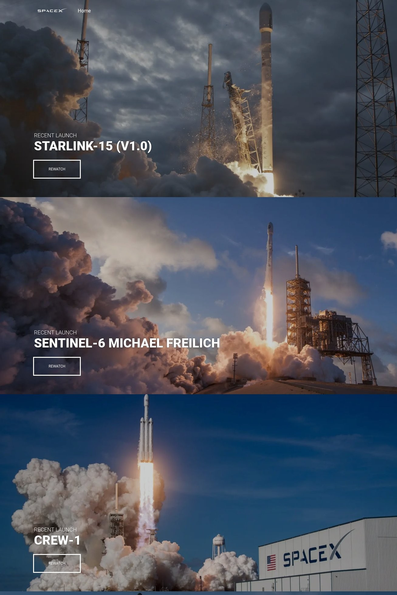
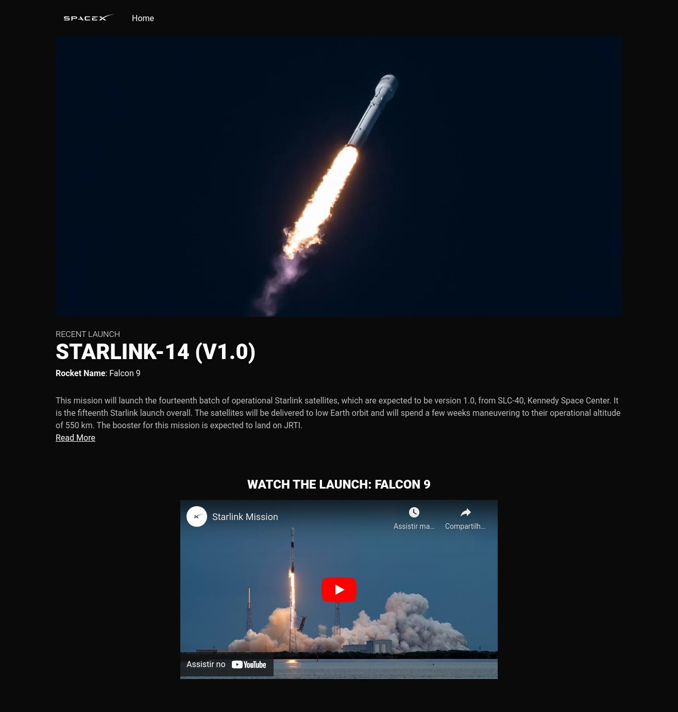

<div align="center">
  
  <p>SpaceX Launches with Next.JS + GraphQL and Styled Components</p>
</div>

## Tecnologies and Tools
- React.js
- Next.js
- GraphQL
- Apollo Client
- Styled Components
- Typescript
- Husky
- Eslint
- Node.js (v14.19.3)
- yarn (1.22.18) / npm (6.14.17)

## Screenshots
<div align="center">
  <p>Home Page</p>
  
</div>
<br />
<br />
<div align="center">
  <p>Launch Page</p>
  
</div>

## Install dependencies
```bash
npm install
# or
yarn
```

## Run the development server
```bash
npm run dev
# or
yarn dev
```

## Run the production server
First, run build command

```bash
npm run build
# or
yarn build
```
<br />

Run production mode

```bash
npm run start
# or
yarn start
```